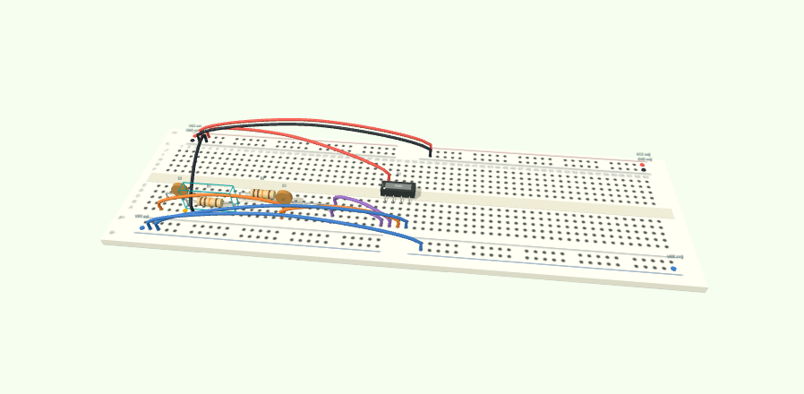

# NoMoreMistakesForEngineers

**Design circuits. Investigate failures. Make the evidence visible.**

[](https://github.com/Kutnkor/NoMoreMistakesForEngineers/actions/workflows/ci.yml)

Circuit Forge is a browser-based electronics workbench by [Kutnkor](https://github.com/Kutnkor). It brings together analog filter optimization, synthetic fault diagnosis, Arduino/ESP32/Pico project generation, and an interactive 2D/3D breadboard. No physical hardware or paid AI API is required to explore the application.



[Quick start](#quick-start) · [Research and results](docs/RESEARCH.md) · [Türkçe dokümantasyon](README.tr.md) · [GitHub'a yükleme](docs/GITHUB_KURULUM.tr.md)

## Explore the workbench

| Workspace | What you can do |
| --- | --- |
| **Hardware Studio** `/` | Browse 47 boards and 46 physical components, select supported profiles, inspect pin/voltage/address conflicts, and export code and wiring. |
| **Filter AI** `/filter` | Optimize a Sallen–Key low-pass filter using Gaussian-process Bayesian optimization; compare it with random search at the same evaluation budget. |
| **AI Laboratory** `/lab` | Compare ideal and finite-bandwidth op-amps, investigate six fault classes, compare simulation-budget strategies, and explore sensor aliasing. |
| **Breadboard Lab** `/breadboard` | Place components on an 830-hole board; switch between 2D and 3D; diagnose physical connectivity; export PNGs and a printable assembly guide. |
| **Research** `/research` | Read methods, recorded experiments, validation reports, and the boundaries of the current models. |

The application interface, validation messages, export guides, and downloadable research notes are in English. The hardware catalog is broader than the executable support: **12 detailed board profiles**, **24 module code templates**, and a Wokwi export subset of **5 boards / 10 part types**. Support boundaries are visible in the interface and documented in [Arduino scope](research/ARDUINO_SCOPE.md).

### From a design to a virtual build

1. Open **Filter AI**, choose pass/stop requirements and component tolerances, and run an optimization.
2. Compare the AI and random-search curves, then inspect the held-out tolerance evaluation.
3. Send the selected design to **Breadboard Lab**. Drag a part or add a wire and inspect the resulting connectivity diagnostics.
4. Export a circuit report, SPICE netlist, PNG, or assembly guide. Supported embedded designs can also be exported as Wokwi projects.

Breadboard Lab includes five circuit presets, manual wiring, rotation, undo, bidirectional net highlighting, JSON circuit import, and a guided assembly mode. Physical copper connectivity is computed independently of the intended circuit labels.

## Quick start

Install **Node.js 24** and **pnpm 11.19.0**. If pnpm is not installed, run `npm install --global pnpm@11.19.0` after installing Node.js.

```sh
git clone https://github.com/Kutnkor/NoMoreMistakesForEngineers.git
cd NoMoreMistakesForEngineers
pnpm install --frozen-lockfile
pnpm dev
```

Open the local URL printed by the development server. If using the source ZIP, extract it and start with `pnpm install --frozen-lockfile` inside its folder.

```sh
pnpm check       # lint, types, unit tests, production build, bundled worker tests
pnpm start       # serve the production build at http://127.0.0.1:4173
```

The app runs its computations locally in Web Workers. It needs no `.env` file, API key, cloud account, ngspice installation, or connected board for normal use. Browser Web Serial is optional and requires a device selected by the user.

The static build is written to `dist/client/`. A deployment host must serve this folder at the domain root and resolve clean paths such as `/breadboard` to `/breadboard.html`. The included preview server does this. GitHub project Pages uses a repository subpath by default; that deployment is **not configured** in this repository.

## Measured results

These are recorded results for the stated experiments, not guarantees for other circuits or hardware.

| Check | Recorded result | Evidence |
| --- | --- | --- |
| Regression suite | 50 tests: 49 domain checks plus one standalone preview-server regression | [Tests](tests/) |
| Finite op-amp model | Compared with native ngspice 47: 30 designs × 401 frequency points | [Report](research/ngspice-validation.json) |
| Fault classifier | 98% top-1 accuracy on 1,200 held-out **synthetic** examples | [Report](research/fault-model-report.json) |
| Embedded export | 53/53 Wokwi diagrams validated; 33/33 additional sketches compiled | [Report](research/embedded-validation.json) |
| Budget allocation | 30 experiments across three conditions; results are mixed across methods | [Benchmark](research/budget-benchmark.json) |
| Breadboard browser checks | Dragging, wiring, guided assembly, mobile/dark display, and five single-page print guides | [Report](research/breadboard-browser-validation.json) |

The trained fault model is included. Its synthetic data generator and training script are available in `scripts/`. The externally supplied NPZ data audited in `research/data-audit.md` is **not bundled** and was **not used to train this classifier**.

## Engineering and research scope

- The filter optimizer currently searches component values for **one** Sallen–Key low-pass topology. The five breadboard presets are a separate feature; they are not five AI-optimized topologies.
- The analog models omit saturation, slew rate, noise, parasitics and thermal effects. Browser simulation and CLI compilation do not establish physical-hardware performance.
- The fault classifier learns from synthetic responses for a bounded circuit/fault model. Its reported accuracy is not a real-world diagnostic accuracy claim.
- Wokwi export creates project files; the app does not embed or execute the Wokwi cloud simulator.
- No universal improvement over random search is claimed. Seeds, equal budgets, held-out evaluation and unsuccessful outcomes are retained.

Read [Research and reproduction](docs/RESEARCH.md) for experiment commands, assumptions and the distinction between included features and historical external work.

## Architecture

```text
app/                   Four workspaces, research page and application styles
components/            Studio, lab and breadboard interfaces
lib/                   Circuit math, search, hardware profiles and connectivity
public/                Local product imagery, model assets and reports
scripts/               Benchmarks, model training, exports and preview server
tests/                 Unit, production-worker and optional browser checks
research/              Methods, data audits and recorded experiment evidence
```

Built with TypeScript, React, vinext/Vite, Three.js and Tailwind CSS. The versioned dependency lockfile is included. The repository has a GitHub Actions workflow that runs the local checks on pushes and pull requests and uploads the static build; it does not deploy automatically.

## Contributing and attribution

See [CONTRIBUTING.md](CONTRIBUTING.md) for changes, reproducible bug reports and validation expectations. This project was developed with AI assistance. Project ownership and research contributions should be described using work and experiments the author can explain and reproduce; AI-assisted implementation is not evidence of independent authorship or admissions outcomes.

Original project code is offered under the [MIT license](LICENSE). Product photographs, manufacturer marks and other third-party materials retain their own rights; see [THIRD_PARTY_NOTICES.md](THIRD_PARTY_NOTICES.md) and the per-image source records. Attribution does not imply endorsement or a verified open license for every image.
